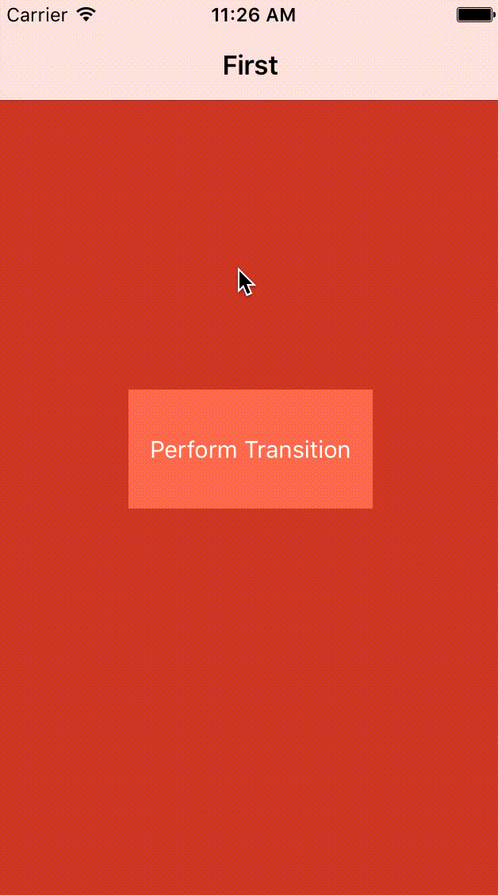

# francetv zoom ViewController Transition

This project is part of [francetv zoom open source projects](https://github.com/francetv/zoom-public) (iOS, Android and Angular).

## Summary

Simple Swift project demonstrating how the custom transition from the playlists screen
to the player screen was made for **francetv zoom**, by implementing the `UINavigationControllerDelegate` and `UIViewControllerAnimatedTransitioning` protocols.



## Usage

Drag the **FTVCustomAnimatedTransitioning.swift** file into your project.
Then, in the root `UIViewController` of your navigation, implement the `UINavigationControllerDelegate` as follows:

```Swift
class YourRootViewController: UIViewController {
...
    override func viewWillAppear(animated: Bool) {

        super.viewWillAppear(animated)
        navigationController?.delegate = self
    }
...
}

// MARK: - UINavigationControllerDelegate

extension YourRootViewController: UINavigationControllerDelegate {

    func navigationController(navigationController: UINavigationController, animationControllerForOperation operation: UINavigationControllerOperation, fromViewController fromVC: UIViewController, toViewController toVC: UIViewController) -> UIViewControllerAnimatedTransitioning? {

        return FTVCustomAnimatedTransitioning()
    }
}
```

Finally, nullify the `UINavigationControllerDelegate` in the destination `UIViewController`:

```Swift
class YourDestinationViewController: UIViewController {
...    
    override func viewWillAppear(animated: Bool) {

        super.viewWillAppear(animated)
        navigationController?.delegate = nil
    }
...    
}
```

## Example

To try the example project, clone the repo, and run the project.

## Requirements

  + ARC
  + iOS 8

## License

  This project is available under the MIT license. See the LICENSE file for more info.
